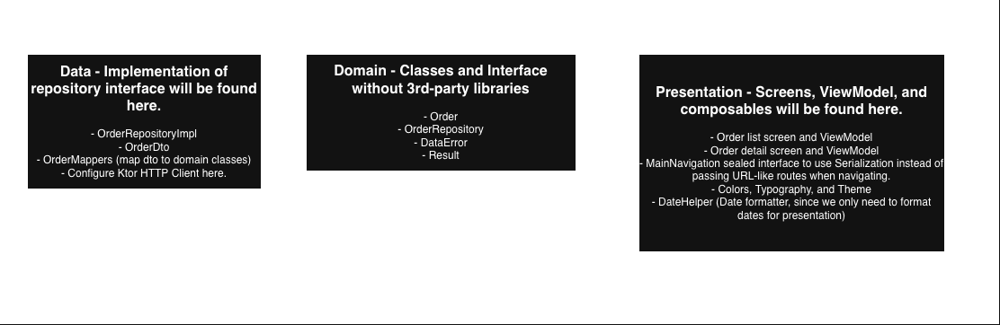

# Delivery Tracker
An android application take home test that calls API endpoint from https://mockapi.io

# Feature
- In detail screen, I've added a refresh mechanism that will fire every 10 seconds to get the near real-time updates.

# Recording

# Tech stack
- Kotlin coroutines - Write asynchronous code in a synchronous way. Coroutines made network calls easier in this project.
- Jetpack Compose - Modern way to create UI.
- Nav2 - Used this instead of Nav3 since this is more mature.
- Koin - Dependency injection library.
- Ktor - Networking library to call HTTP endpoints.
- KotlinX Serialization - To serialize/deserialize JSON string.
- AssertK - Kotlin-first assertion library.
- Turbine - Lightweight library to test flows.

# Architecture diagram

# Trade-offs
- I did not focus much on the overall look of the UI to improve the code readability and add unit test for OrderListViewModel

# Future improvements
- I will add caching using Room database, everytime I get all the orders I will immediately save it locally and observe that, it will increase UX by supporting offline mode.
- This application needs authentication of course, but was omitted because of time constraints. We don't want other users seeing our orders.
- **Question**: If you had more time, how would you add real-time driver tracking on a
  map so customers can see their delivery progress?
    - **Answer**: I can see that we can do this in 2 ways: The first one is using polling, we will call the API endpoint every X seconds to refresh the status automatically while the user is in detail screen. The second method is to use WebSockets, both customer and driver will be connected in WebSocket, the driver will send a new location every X seconds, and the customer will be notified without spamming the server.

# How to run
- Clone or fork the project, build, then run. No extra configurations needed.